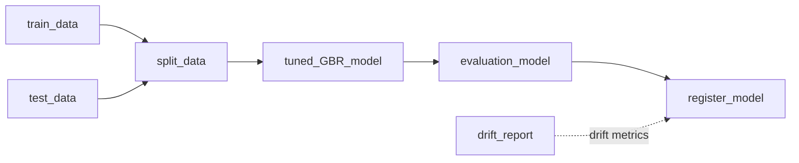
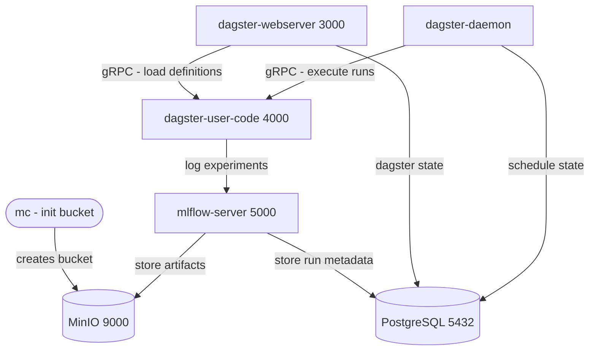
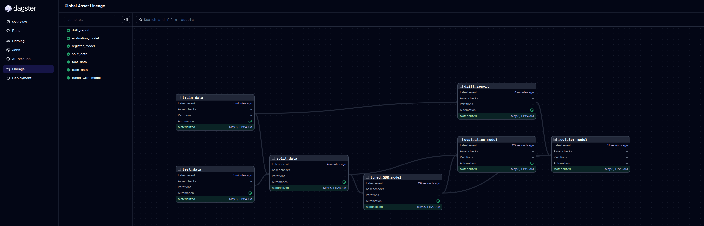

# mlops-cmapss-pipeline

**End-to-end MLOps pipeline for turbofan engine RUL (Remaining Useful Life) prediction**, built on the NASA CMAPSS dataset. Demonstrates production-grade MLOps practices: orchestration, experiment tracking, artifact storage, data drift monitoring, and CI/CD automation — all running locally via Docker Compose.

---

## Table of Contents

- [Overview](#overview)
- [Architecture](#architecture)
- [Pipeline](#pipeline)
- [Screenshots](#screenshots)
- [Tech Stack](#tech-stack)
- [Getting Started](#getting-started)
- [Project Structure](#project-structure)
- [CI/CD](#cicd)

---

## Overview

Predicting **Remaining Useful Life (RUL)** of aircraft turbofan engines is a classic predictive maintenance problem. This project treats it as an end-to-end MLOps challenge — not just training a model, but building the full operational system around it.

**Dataset:** [NASA CMAPSS](https://www.nasa.gov/intelligent-systems-division/discovery-and-systems-health/pcoe/pcoe-data-set-repository/) — simulated degradation trajectories for turbofan engines across 4 sub-datasets (FD001–FD004), varying operating conditions and fault modes.

**What this pipeline does:**

- Ingests and preprocesses CMAPSS sensor data
- Tunes and trains a `GradientBoostingRegressor` via `RandomizedSearchCV`
- Tracks every experiment run in MLflow (params, metrics, artifacts)
- Registers the best model in MLflow Model Registry with a `@champion` alias
- Detects data drift daily using Evidently AI (reference: healthy engines vs. pre-failure window)
- Automatically retrains weekly; promotes new model only if it outperforms the current champion or drift is detected
- Stores all model artifacts in MinIO (S3-compatible local object store)

---

## Architecture

### Asset Pipeline (Data Flow)




### Infrastructure (Docker Compose — 7 containers)




**Key design decisions:**

- **Dagster gRPC server pattern** — `dagster-user-code` runs in its own container, isolated from the webserver and daemon; both call it via gRPC on port 4000 to load definitions and execute runs
- **Asset-based DAG** — every computation step is a data asset with explicit upstream dependencies, not task-based jobs
- **Conditional model promotion** — `register_model` promotes a new version only if RMSE improves *or* drift share exceeds threshold (30%)
- **Two independent schedules** — drift detection runs daily (lightweight); full retraining runs weekly (Monday 6 AM UTC)
- **MinIO as local S3** — zero cloud dependency for artifact storage; swappable for AWS S3 in production by changing one env var

---

## Pipeline

### Assets & Execution Order


| Step | Asset              | Description                                                                                                                        |
| ---- | ------------------ | ---------------------------------------------------------------------------------------------------------------------------------- |
| 1    | `train_data`       | Load raw training data; compute RUL per engine (`max_cycle - current_cycle`)                                                       |
| 2    | `test_data`        | Load test data; attach ground-truth RUL from `RUL_FD00X.txt`                                                                       |
| 3    | `split_data`       | Drop zero-variance columns; select 18 predictive features; return `X_train / X_test / y_train / y_test`                            |
| 4    | `tuned_GBR_model`  | `RandomizedSearchCV` over GBR hyperparameters (n_estimators, max_depth, learning_rate, subsample, min_samples_leaf); log to MLflow |
| 5    | `evaluation_model` | Compute RMSE / MAE / R2 on test set; generate error analysis plot; log as MLflow child run                                         |
| 6    | `register_model`   | Compare new model vs. current champion; register + assign `@champion` alias if conditions met                                      |
| 7    | `drift_report`     | Compare reference (RUL > 100) vs. current (RUL <= 30) distributions; upload to Evidently Cloud                                     |


### Schedules


| Schedule         | Cron        | Job                        |
| ---------------- | ----------- | -------------------------- |
| `daily_drift`    | `0 6 `* * * | `drift_report` only        |
| `weekly_retrain` | `0 6 * * 1` | Full pipeline (assets 1-6) |


---

## Screenshots

### Dagster — Asset Lineage Graph

All 7 assets materialized successfully, showing the full data lineage from raw ingestion to model registration and drift monitoring.



### Dagster — Run Timeline

Step-level execution timeline for a full pipeline run, showing sequential asset materialization with Dagster event logs.

Dagster Run Timeline

### MLflow — Experiment Runs

Multiple `hyperparameter-tuning` runs tracked in the `CMAPSS` experiment. Each run is triggered by Dagster and versioned with the registered model (`cmapss-rul-predictor v1-v4`).

MLflow Runs

### MLflow — Model Registry

`cmapss-rul-predictor` with 4 registered versions. Version 4 holds the `@champion` alias, marking it as the current production model.

MLflow Registry

### MinIO — Artifact Storage

S3-compatible local object store holding MLflow model artifacts: `MLmodel`, `model.pkl`, `conda.yaml`, `python_env.yaml`, `requirements.txt`.

MinIO Artifacts

### Evidently AI — Data Drift Report

Drift detected in **15 out of 17 columns** (88.2% drift share) when comparing healthy engine operation (RUL > 100) vs. pre-failure window (RUL <= 30). This intentional comparison validates that the drift detection logic correctly identifies distributional shifts caused by engine degradation.

Evidently Drift Report

---

## Tech Stack


| Layer                   | Tool                                        | Purpose                                           |
| ----------------------- | ------------------------------------------- | ------------------------------------------------- |
| **Orchestration**       | [Dagster 1.13](https://dagster.io)          | Asset-based pipeline DAG, schedules, UI           |
| **Experiment Tracking** | [MLflow 3.11](https://mlflow.org)           | Run logging, model registry, artifact tracking    |
| **Drift Monitoring**    | [Evidently AI 0.7](https://evidentlyai.com) | Statistical data drift detection + cloud reports  |
| **ML**                  | scikit-learn `GradientBoostingRegressor`    | Predictive model + `RandomizedSearchCV` tuning    |
| **Artifact Storage**    | [MinIO](https://min.io)                     | S3-compatible local object store                  |
| **Database**            | PostgreSQL 16                               | Backend store for MLflow metadata + Dagster state |
| **Containerization**    | Docker Compose                              | Multi-service local deployment (7 containers)     |
| **CI/CD**               | GitHub Actions                              | Lint (ruff) + test (pytest) on push/PR            |
| **Package Manager**     | [uv](https://github.com/astral-sh/uv)       | Fast dependency resolution with locked installs   |


---

## Getting Started

### Prerequisites

- Docker & Docker Compose
- An [Evidently Cloud](https://app.evidently.cloud) account (free tier) for drift report uploads

### 1. Clone the repository

```bash
git clone https://github.com/MikolajRusin/mlops-cmapss-pipeline.git
cd mlops-cmapss-pipeline
```

### 2. Configure environment variables

Copy the example env file:

```bash
cp .env.example .env
```

`.env.example` ships with all local infrastructure values pre-filled (PostgreSQL, MinIO, MLflow). Only the Evidently AI credentials need to be set:

```env
EVIDENTLY_AI_API_KEY=your_evidently_api_key
EVIDENTLY_AI_ORG_ID=your_evidently_org_id
EVIDENTLY_AI_PROJECT_ID=your_evidently_project_id
```

Obtain these from your [Evidently Cloud workspace](https://app.evidently.cloud) under Settings > API Keys.

### 3. Start all services

```bash
docker compose up -d --build
```

This starts 7 containers. Wait ~30 seconds for health checks to pass (MLflow waits for PostgreSQL and MinIO to be healthy before starting).


| Service       | URL                                            |
| ------------- | ---------------------------------------------- |
| Dagster UI    | [http://localhost:3000](http://localhost:3000) |
| MLflow UI     | [http://localhost:5000](http://localhost:5000) |
| MinIO Console | [http://localhost:9001](http://localhost:9001) |


### 4. Run the pipeline

**Via Dagster UI:**

1. Open [http://localhost:3000](http://localhost:3000)
2. Go to **Assets** > select all assets > **Materialize All**

**Via schedules (automatic):**

- Drift detection runs every day at 6 AM UTC (`daily_drift`)
- Full retraining runs every Monday at 6 AM UTC (`weekly_retrain`)

### 5. Run tests locally

```bash
# Install dependencies (requires uv)
uv sync

# Run unit tests
uv run pytest tests

# Lint
uv run ruff check src/
```

### Teardown

```bash
docker compose down -v
```

---

## Project Structure

```
mlops-cmapss-pipeline/
├── src/cmapss_pipeline/
│   ├── assets/
│   │   ├── data.py                  # train_data, test_data, split_data
│   │   ├── model.py                 # tuned_GBR_model, evaluation_model, register_model
│   │   └── drift.py                 # drift_report
│   ├── resources/
│   │   ├── mlflow_resource.py       # MLflow ConfigurableResource
│   │   └── evidentlyai_resource.py  # Evidently AI ConfigurableResource
│   ├── schedules/
│   │   ├── retrain.py               # weekly_retrain schedule
│   │   └── drift.py                 # daily_drift schedule
│   ├── config.py                    # Column definitions & feature selection
│   └── definitions.py               # Dagster Definitions (assets + resources + schedules)
├── data/                            # CMAPSS dataset files (FD001-FD004)
├── dockerfiles/
│   ├── dagster.Dockerfile           # webserver + daemon image
│   ├── dagster_user_code.Dockerfile # user code gRPC server image
│   └── mlflow.Dockerfile            # MLflow tracking server image
├── docs/screenshots/                # UI screenshots for documentation
├── tests/unit/
│   └── test_data.py                 # 12 unit tests for data assets
├── docker-compose.yml               # 7-container service definitions
├── dagster.yaml                     # Dagster storage configuration
├── workspace.yaml                   # Dagster workspace (gRPC server config)
├── pyproject.toml                   # Project metadata & dependencies
├── .env.example                     # Environment variable template
└── .github/workflows/ci.yml         # CI/CD pipeline
```

---

## CI/CD

GitHub Actions workflow runs on every push and pull request to `main`:

```
Checkout -> Setup Python 3.10 -> Install uv -> uv sync --frozen -> ruff check src/ -> pytest tests
```

Uses `uv sync --frozen` to guarantee reproducible installs from the locked dependency file.
